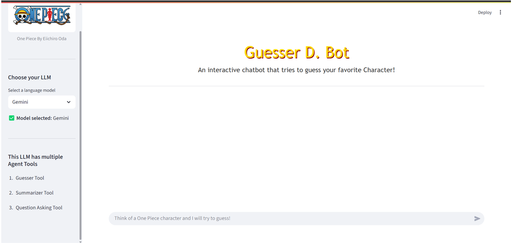

### **1. Project Title & Description**

## "Guesser D. Bot" 

An interactive AI-powered guessing game built around the One Piece anime universe by Eiichiro Oda.
The project demonstrates how AI agents can be deployed seamlessly for domain-specific gaming use cases using modern LLM tooling.
The app is powered by Streamlit, offering a smooth web interface for live interaction with the bot.

---

### **2. Tech Stack and Frameworks** 

* Langchain Framework: https://www.langchain.com/
* Langchain Agent: https://python.langchain.com/docs/how_to/agent_executor/
* FAISS Vector Store Database: https://faiss.ai/
* Gemini LLM Model (gemini-2.5-flash, gemini-2.5-pro): https://ai.google.dev/gemini-api/docs/models
* Gemini Embedding Model (gemini-embedding-001): https://ai.google.dev/gemini-api/docs/embeddings 
* Streamlit: https://streamlit.io/
* Beautiful Soup: https://beautiful-soup-4.readthedocs.io/en/latest/

---

### **3. Features**

* Interactive Gameplay: Think of a One Piece character, and the AI agent will try to guess it by asking smart, dynamic questions.

* RAG System: Built using a Retrieval-Augmented Generation system trained on scraped One Piece character data.

* Web Scraping: Data extracted from One Piece Wiki using BeautifulSoup.

* Modular LangChain Tools:

1. Questioning Tool: Dynamically generates next questions based on prior answers and context.

2. Summarizer Tool: Produces pirate-toned summaries of characters from the knowledge base.

3. Trivia Mode Tool: Offers fun trivia questions for extra engagement.

* Streamlit Chat Interface: Seamless UI to chat with the guessing agent.

* Presentation Included: A short slide deck and demo video available in the /presentation folder.

* All the data has been scraped via bs4 from the website: https://onepiece.fandom.com/wiki

---

### **4. Installation**

* Clone the repository:

        git clone https://github.com/kalakhushi18/Guesser-D.-Bot.git

* Create a virtual environment: 

        python -m venv venv
        venv\Scripts\activate on Windows

* Install dependencies 

        pip install -r requirements.txt

* Set up Gemini API

    Generate a GEMINI_API_KEY from Google AI Developers Console

        Create a .streamlit/secrets.toml file with:

        GEMINI_API_KEY = "your-key-here"

* Prepare character data
  The app uses pre-scraped character data. To scrape additional characters, run:
  
        python web_data.py
* Run the app
        streamlit run app.py 
* 
* To run the streamlit application, come to the root of the project then run the cmd: streamlit run app.py

---

### **5. Usage**

Start the app and follow the agent’s questions. Answer honestly, and let the bot guess your character!

---

### **6. Roadmap** 

 * Add support for more One Piece arcs and side characters

 * Integrate voice input/output

 * Add heatmap of guessing confidence

 * Plot twist mode with misleading clues

 * Use LangGraph in more precise impelementation

---
### **7. Acknowledgements**

* Inspired by Akinator and the One Piece fandom.

* Powered by open-source frameworks: LangChain, FAISS, Streamlit.

* Data source: One Piece Wiki

